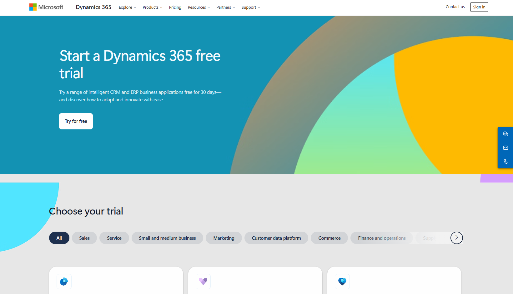
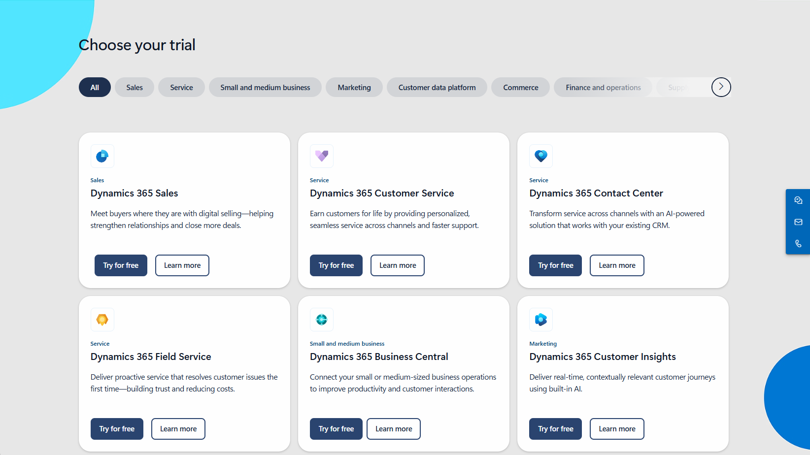
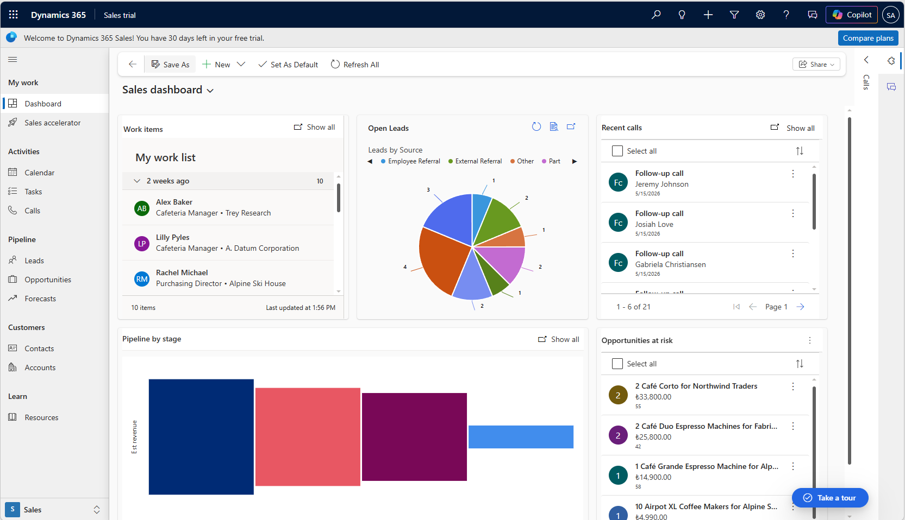
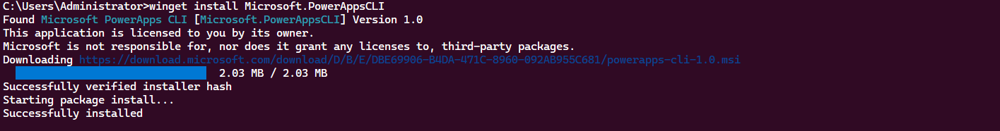

:stem:
:rouge-style: {{ .Site.Params.rougeTheme }}
:toc: left
:toc-title: 

== Giriş

Dynamics 365'i teorik olarak tanımak ile çalışan bir ortamda görmek arasında belirgin bir fark vardır. Bu yazı, o farkı kapatmak amacıyla hazırlanmıştır. Bir deneme hesabı açılacak, Dynamics 365 Sales arayüzü tanınacak ve kod yazmaya başlamak için gerekli geliştirme araçları kurulacaktır. Sonraki bölümlerde yapılacak tüm özelleştirme ve kodlu geliştirme çalışmaları, burada hazırlanan ortam üzerinde ilerleyecektir.

== Deneme Hesabı Açma

Microsoft, Dynamics 365'i öğrenmek isteyenlere 30 günlük ücretsiz bir deneme ortamı sunar. Bu ortam, canlı bir üretim ortamıyla aynı özelliklere sahiptir. İçinde örnek veriler bulunur; bu veriler değiştirilebilir, silinebilir veya üzerine yenileri eklenebilir. Ortam sıfırlanabilir olduğundan hatalı bir işlem kalıcı bir soruna yol açmaz.

Deneme hesabı açmak için bir iş veya okul hesabı gerekmektedir. Kişisel e-posta adresleriyle — outlook.com, hotmail.com veya gmail.com gibi — deneme ortamı başlatmak mümkün değildir. Microsoft 365 Developer Program bu kısıtlamanın etrafından dolaşmak için bir yol sunsa da bu yazının yazıldığı tarih itibarıyla programa kayıt olmak ve hesabı aktive etmek oldukça zahmetlidir. Bu nedenle serinin devamında bir okul veya iş hesabı üzerinden ilerleneceği varsayılmaktadır.

Bir iş veya okul hesabına sahip kullanıcılar tarayıcı üzerinden https://www.microsoft.com/en-us/dynamics-365/free-trial adresine gidebilir. Sayfa açıldığında "Start a Dynamics 365 free trial" başlığı ve "Try for free" butonu ile karşılaşılır.

Sayfada aşağıya kaydırıldığında "Choose your trial" başlığı altında Dynamics 365'in farklı modülleri listelenir: Sales, Customer Service, Contact Center, Field Service, Business Central, Customer Insights ve diğerleri. Her modülün altında "Try for free" ve "Learn more" olmak üzere iki buton bulunur.

Bu modüllerden biri seçilip "Try for free" butonuna tıklandığında sistem, bir Microsoft hesabıyla oturum açılmasını ister. Oturum açma işlemi tamamlandıktan sonra deneme ortamının hangi bölgede oluşturulacağına dair birkaç temel ayar sorulur. Form onaylandığında ortamın hazırlanması birkaç dakika sürer.

İşlem tamamlandığında kullanıcı doğrudan seçilen modülün arayüzüne yönlendirilir. Örneğin Dynamics 365 Sales için deneme başlatıldığında karşıya gelen ekran aşağıdaki gibidir.

Sol tarafta My work, Activities, Pipeline, Customers ve Learn gibi gruplar altında düzenlenmiş bir site haritası bulunur. Ortada ve sağda ise örnek verilerle doldurulmuş Sales Dashboard görünümü yer alır: bekleyen iş kalemleri, açık lead'ler, pipeline aşamalarına göre tahmini gelir ve risk altındaki fırsatlar bu panoda bir arada sunulur. Bu ekran, bir satış yöneticisinin günlük olarak takip edeceği bilgilerin tek bir görünümde nasıl toplandığını somut biçimde göstermektedir.

== Dynamics 365 Sales Arayüzü

Deneme ortamı hazırlandığında sistem, kullanıcıyı doğrudan seçilen modülün ana ekranına yönlendirir. Dynamics 365 Sales için bu ekran, örnek verilerle doldurulmuş bir Sales Dashboard'dur.

Ekranın sol tarafında site haritası yer alır. Bu menü birkaç ana grup altında düzenlenmiştir. My work grubu altında Dashboard, Sales accelerator gibi günlük çalışma öğeleri bulunur. Activities grubu takvim, görevler ve aramalar gibi aktivite kayıtlarını barındırır. Pipeline grubu Leads, Opportunities ve Forecasts tablolarına erişim sağlar. Customers grubu ise Contacts ve Accounts tablolarını içerir. Daha önce Temel Kavramlar yazısında ele alınan bu yapı, burada somut olarak karşımıza çıkmaktadır.

Ekranın ortasında ve sağında ise çeşitli panolar yer alır: bekleyen iş kalemleri, lead kaynağına göre dağılım grafiği, pipeline aşamalarına göre tahmini gelir ve risk altındaki fırsatlar. Bu panolar, örnek verilerle önceden doldurulmuş olduğundan ortam ilk açıldığında bile işlevsel bir görünüm sunar.

Bu arayüz, serinin ilerleyen bölümlerinde sıkça karşılaşılacak olan model-driven uygulama yapısının tipik bir örneğidir. Şimdilik arayüzü tanımak yeterlidir; bu yapının nasıl özelleştirileceği ilerleyen yazılarda ele alınacaktır.

== Geliştirme Araçlarının Kurulumu

Dynamics 365 üzerinde plugin geliştirmek için aşağıdaki araçların kurulu olması gerekmektedir.

=== Visual Studio

Dynamics 365 plugin geliştirme sürecinin temel aracı Visual Studio'dur. Bu yazı kapsamında Visual Studio 2022 kullanılmaktadır. Henüz kurulu değilse https://visualstudio.microsoft.com adresinden indirilebilir. Kurulum sırasında **.NET desktop development** iş yükünün seçili olması yeterlidir.

=== Power Platform Tools

Visual Studio tek başına Dynamics 365 geliştirme için yeterli değildir. Microsoft'un sunduğu Power Platform Tools eklentisi, plugin projesi oluşturma, derleme ve ortama dağıtım işlemlerini Visual Studio içinden yönetmeyi sağlar.

Eklentiyi yüklemek için Visual Studio içinden Extensions > Manage Extensions menüsüne gidin. Açılan pencerede arama kutusuna "Power Platform Tools" yazın ve Microsoft tarafından yayımlanan eklentiyi yükleyin. Yükleme tamamlandıktan sonra Visual Studio'nun yeniden başlatılması gerekir.

=== Plugin Registration Tool

Plugin Registration Tool, geliştirilen plugin'lerin Dynamics 365 ortamına kayıt edilmesini sağlayan bir araçtır. Visual Studio eklentisinden bağımsız olarak çalışır ve doğrudan Dataverse ortamına bağlanır.

Bu aracı edinmenin iki yolu vardır. Birincisi, doğrudan NuGet paketi olarak indirmektir. Bunun için Visual Studio'da Tools > NuGet Package Manager > Package Manager Console menüsünü açın ve aşağıdaki komutu çalıştırın:

[source,shell]

Install-Package Microsoft.CrmSdk.XrmTooling.PluginRegistrationTool

Bu komut, PRT'yi projenin .\Tools klasörü altına indirir.

İkinci yol ise Microsoft Power Platform CLI üzerinden PRT'yi başlatmaktır. Power Platform CLI'ı yüklemek için bir Terminal penceresi açıp aşağıdaki komutu çalıştırın:

[source,shell]

winget install Microsoft.PowerAppsCLI

Kurulum tamamlandıktan sonra, aşağıdaki komutla PRT doğrudan başlatılabilir:

[source,shell]

pac tool prt

Bu komut, gerekli bağımlılıkları otomatik olarak indirir ve aracı açar. Ortama bağlanmak için pac auth create komutuyla önceden kimlik doğrulaması yapılması gerekir. Bu adıma ilerleyen yazılarda daha ayrıntılı dönülecektir.

=== .NET Sürümü

Dynamics 365 plugin'leri en az .NET Framework 4.6.2 hedeflenerek derlenir. .NET Core, .NET 5 ve sonrasındaki platformlar in-process plugin'ler için desteklenmez. Visual Studio kurulumu sırasında .NET desktop development iş yükü seçildiyse gerekli Framework bileşeni zaten yüklü gelir. Aksi takdirde Visual Studio Installer üzerinden sonradan eklenebilir.

== Sonuç

Bu yazıda Dynamics 365 deneme ortamı kuruldu, Sales arayüzü tanıtıldı ve plugin geliştirme için gerekli araçlar kuruluma hazır hale getirildi. Bir sonraki yazıda bu araçları kullanarak ilk plugin projesini oluşturacak ve Dynamics 365 ortamına kayıt edeceğiz.